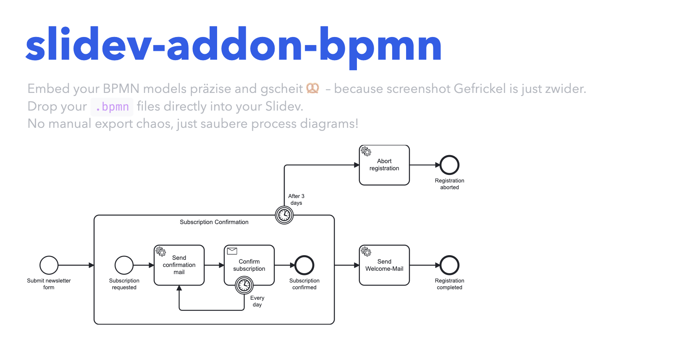

# 📊 slidev-addon-bpmn

[](https://www.npmjs.com/package/slidev-addon-bpmn)
[](https://github.com/emaarco/slidev-addon-bpmn/blob/main/LICENSE)

Display BPMN 2.0 diagrams in your [Slidev](https://sli.dev/) presentations. Whether you're presenting workflow designs, explaining process automation, or teaching BPMN concepts — this addon has you covered! 💡

Powered by [bpmn-js](https://bpmn.io/toolkit/bpmn-js/) from bpmn.io.

## 🚀 Quick Start

1. Install the addon in your Slidev project
2. Place your `.bpmn` files in the `public/` folder
3. Use the `<Bpmn>` component in your slides

That's it — your BPMN diagrams are ready to present!

## Example Slide



## 📦 Installation

```bash
npm install slidev-addon-bpmn
```

Then register the addon in your slide's frontmatter:

```yaml
---
addons:
  - slidev-addon-bpmn
---
```

Or in your `package.json`:

```json
{
  "slidev": {
    "addons": ["slidev-addon-bpmn"]
  }
}
```

## 🔧 Usage

```vue
<Bpmn
  bpmnFilePath="./my-process.bpmn"
  class="w-[800px]"
/>
```

The component fetches your BPMN file, renders it using bpmn-js, and exports it as a crisp SVG that scales beautifully at any size.

## ⚙️ Props

| Name | Type | Default | Description |
|------|------|---------|-------------|
| `bpmnFilePath` | `string` | *required* | Path to the `.bpmn` file (relative to `public/`) |
| `width` | `string` | `'100%'` | Maximum width of the diagram |
| `height` | `string` | `'auto'` | Height of the diagram |

## 💡 Tips

- **File location**: BPMN files must be placed in the `public/` folder
- **Supported formats**: Standard BPMN 2.0 XML files (exported from Camunda Modeler, bpmn.io, etc.)
- **Styling**: Use Tailwind classes via the `class` prop to control sizing
- **Export**: Works seamlessly with Slidev's PDF/PNG export features

## 🤝 Contributing

Contributions are welcome! Feel free to report bugs, suggest features via [issues](https://github.com/emaarco/slidev-addon-bpmn/issues), submit pull requests with improvements, or share your ideas and use cases.

To develop locally: clone the repo, run `npm install`, then `npm run dev` to test your changes.

## 🙏 Credits

- [bpmn-js](https://github.com/bpmn-io/bpmn-js) by [bpmn.io](https://bpmn.io/)
- Inspired by [slidev-addon-excalidraw](https://github.com/haydenull/slidev-addon-excalidraw)
- [bavaria-ipsum](https://bavaria-ipsum.de/) - for making the example slide a little more entertaining 🥨