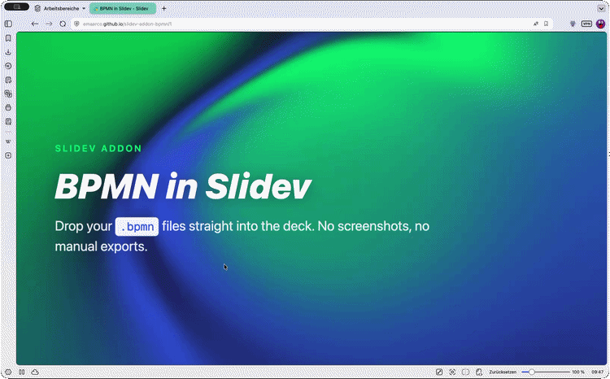

# 📊 slidev-addon-bpmn

[](https://www.npmjs.com/package/slidev-addon-bpmn)
[](https://github.com/emaarco/slidev-addon-bpmn/blob/main/LICENSE)
[](https://emaarco.github.io/slidev-addon-bpmn/)

Display BPMN 2.0 diagrams in your [Slidev](https://sli.dev/) presentations. Whether you're presenting workflow designs, explaining process automation, or teaching BPMN concepts — this addon has you covered! 💡

Powered by [bpmn-js](https://bpmn.io/toolkit/bpmn-js/) from bpmn.io.

## 🚀 Quick Start

1. Install the addon in your Slidev project
2. Place your `.bpmn` files in the `public/` folder
3. Use the `<Bpmn>` component in your slides

That's it — your BPMN diagrams are ready to present!

## Example Slide



## 📦 Installation

```bash
npm install slidev-addon-bpmn
```

Then register the addon in your slide's frontmatter:

```yaml
---
addons:
  - slidev-addon-bpmn
---
```

Or in your `package.json`:

```json
{
  "slidev": {
    "addons": ["slidev-addon-bpmn"]
  }
}
```

## 🧩 Components

This addon provides three complementary components for different use cases:

- **`<Bpmn>`** - Static BPMN rendering for PDFs, presentations, and documentation
- **`<BpmnTokenSimulation>`** - Interactive token-based process simulation for live demos
- **`<BpmnModeler>`** - Interactive BPMN modeler for live diagram editing during workshops and trainings, with optional Zeebe / Camunda 7 properties panel

## 🔧 Component Reference

### Bpmn Component

Renders BPMN diagrams as static SVG images. Perfect for PDF exports and presentations.

```vue
<Bpmn
  bpmnFilePath="./my-process.bpmn"
  width="100%"
  height="400px"
/>
```

**Props:**

| Name | Type | Default | Description |
|------|------|---------|-------------|
| `bpmnFilePath` | `string` | *required* | Path to the `.bpmn` file (relative to `public/`) |
| `width` | `string` | `'100%'` | Maximum width of the diagram |
| `height` | `string` | `'auto'` | Height of the diagram |

### BpmnTokenSimulation Component

Renders interactive BPMN diagrams with token simulation capabilities. Perfect for process walkthroughs and training.

```vue
<BpmnTokenSimulation
  bpmnFilePath="./my-process.bpmn"
  width="100%"
  height="500px"
/>
```

**Props:**

| Name | Type | Default | Description |
|------|------|---------|-------------|
| `bpmnFilePath` | `string` | *required* | Path to the `.bpmn` file (relative to `public/`) |
| `width` | `string` | `'100%'` | Width of the diagram container |
| `height` | `string` | `'auto'` | Height of the diagram container (defaults to 500px when 'auto') |
| `maxScale` | `number` | `2` | Cap on how far a small diagram is enlarged past its native size. Lower keeps it smaller; higher lets it fill more. |

The token simulation provides interactive controls for stepping through process execution with animated token flow.

### BpmnModeler Component

Embeds an interactive BPMN modeler for live diagram editing. Ideal for workshops, trainings, and collaborative sessions where you build diagrams step by step.

```vue
<BpmnModeler
  bpmnFilePath="./my-process.bpmn"
  width="100%"
  height="500px"
/>
```

Or start with a blank canvas (a single start event):

```vue
<BpmnModeler height="500px" />
```

Pass an `engine` to mount an engine-specific properties panel side-by-side with the canvas, so you can edit Zeebe `taskDefinition`s, Camunda 7 expressions, message names, and other technical attributes live:

```vue
<!-- Camunda 8 / Zeebe -->
<BpmnModeler bpmnFilePath="./my-process.bpmn" engine="zeebe" height="500px" />

<!-- Camunda 7 / Platform -->
<BpmnModeler bpmnFilePath="./my-process.bpmn" engine="camunda7" height="500px" />
```

In fullscreen mode, the panel can be hidden and shown again via the toolbar — handy when you need the full canvas width.

**Props:**

| Name | Type | Default | Description |
|------|------|---------|-------------|
| `bpmnFilePath` | `string` | — | Optional path to a `.bpmn` file (relative to `public/`). Omit for a blank diagram. |
| `width` | `string` | `'100%'` | Width of the modeler container |
| `height` | `string` | `'500px'` | Height of the modeler container |
| `engine` | `'zeebe' \| 'camunda7'` | — | Optional engine. Mounts a `bpmn-js-properties-panel` configured for the chosen engine. Omit for a panel-less modeler. |
| `maxScale` | `number` | `2` | Cap on how far a small diagram is enlarged past its native size (e.g. a lone start event on a blank canvas). Lower keeps it smaller; higher lets it fill more. |

## 💡 Tips

- **File location**: BPMN files must be placed in the `public/` folder
- **Supported formats**: Standard BPMN 2.0 XML files (exported from Camunda Modeler, bpmn.io, etc.)
- **Styling**: Use Tailwind classes on the component element to control sizing
- **Export**: Each `<Bpmn>` component works seamlessly with Slidev's PDF/PNG export features

## 🔗 Related

> **Looking for DMN?** If you're modeling decision tables alongside your processes, check out
> [slidev-addon-dmn](https://github.com/emaarco/slidev-addon-dmn) — the sister addon for rendering
> DMN diagrams in Slidev!

## 🤝 Contributing

Contributions are welcome! Feel free to report bugs, suggest features via [issues](https://github.com/emaarco/slidev-addon-bpmn/issues), submit pull requests with improvements, or share your ideas and use cases.

To develop locally: clone the repo, run `npm install`, then `npm run dev` to test your changes.

## 🙏 Credits

- [bpmn-js](https://github.com/bpmn-io/bpmn-js) by [bpmn.io](https://bpmn.io/)
- Inspired by [slidev-addon-excalidraw](https://github.com/haydenull/slidev-addon-excalidraw)